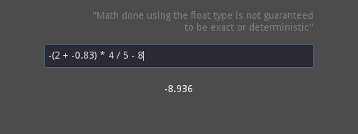

# gdscript-rpn-calculator

## Notes

* 4 arithmetic operations and brackets are supported.
* The implementation converts to [Reverse Polish notation](https://en.wikipedia.org/wiki/Reverse_Polish_notation) using a simplified [Shunting yard algorithm](https://en.wikipedia.org/wiki/Shunting_yard_algorithm).
* The standard [Expression](https://docs.godotengine.org/en/stable/classes/class_expression.html) class is intentionally not used.
